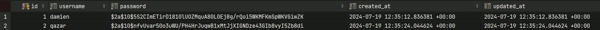
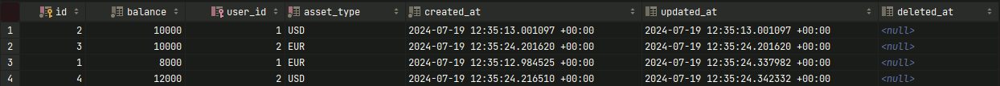
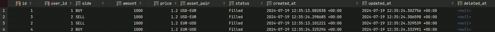

# github.com/q4Zar/go-rest-api


## State of Mind

- Overall, I decided to use Goyave because I like the way it is built and its integration with PostgreSQL through native GORM. I think it's super pertinent ;)
    - I had never used it before starting the test. I did a little research and discovered it.
    - So, I encountered a bit of a learning curve, but it was cool and stimulating for my brain.
    - I could promote the framework a lot, though!

- I switched from basic auth to JWT because it allows me to recognize the owner of any resource.
    - If we want to build a good product with a long-term vision, this is the way to go.
    - I hope you'll see the benefits :)


## Tiny Docs
### Create User
`curl -s -X POST -d '{"username": "qazar", "password": "p4ssW0rd_"}' -H "Content-Type: application/json" "$go_api/users"`
### Login User
`token=$(curl -s -X POST -d '{"username": "qazar", "password": "p4ssW0rd_"}' -H "Content-Type: application/json" "$go_api/login" | jq -r '.token')`
---
### Create Asset
#### EUR
`asset_euro_success=$(curl -s -X POST -H "Authorization: Bearer $token" -d '{"assetType": "EUR", "balance" : 10000}' -H "Content-Type: application/json" "$go_api/assets")`
#### USD
`asset_dollar_success=$(curl -s -X POST -H "Authorization: Bearer $token" -d '{"assetType": "USD", "balance" : 10000}' -H "Content-Type: application/json" "$go_api/assets")`
---
### Create Order
#### USD-EUR
`order_buy_usdeur=$(curl -s -X POST -H "Authorization: Bearer $token" -d '{"amount": 1000, "price" : 1.2, "side":"SELL", "assetPair" : "USD-EUR"}' -H "Content-Type: application/json" "$go_api/orders")`
`order_buy_usdeur=$(curl -s -X POST -H "Authorization: Bearer $token" -d '{"amount": 1000, "price" : 1.2, "side":"BUY", "assetPair" : "USD-EUR"}' -H "Content-Type: application/json" "$go_api/orders")`
#### EUR-USD
`order_buy_eurusd=$(curl -s -X POST -H "Authorization: Bearer $token" -d '{"amount": 1000, "price" : 1.2, "side":"BUY", "assetPair" : "EUR-USD"}' -H "Content-Type: application/json" "$go_api/orders")`
`order_buy_eurusd=$(curl -s -X POST -H "Authorization: Bearer $token" -d '{"amount": 1000, "price" : 1.2, "side":"SELL", "assetPair" : "EUR-USD"}' -H "Content-Type: application/json" "$go_api/orders")`
---
### Get Assets
`assets=$(curl -s -H "Authorization: Bearer $token" "$go_api/assets?fields=balance,asset_type,user_id")`
---
### Get Orders
`orders=$(curl -s -H "Authorization: Bearer $token" "$go_api/orders")`


## Running (2 Terminals for better readability)
**I automatized everything but there is some output defaults so it's easier to just trigger it manually)

### Terminal 1
- sudo make all (run postgres, migrate, boot api)
**Wait for**
```
go-api-1    |
go-api-1    |  INFO  2024/07/19 12:28:02.40583 (/app/main.go:39)
go-api-1    | Registering hooks
go-api-1    |
go-api-1    |  INFO  2024/07/19 12:28:02.406913 (/app/main.go:62)
go-api-1    | Registering services
go-api-1    |
go-api-1    |  INFO  2024/07/19 12:28:02.406986 (/app/main.go:52)
go-api-1    | Registering routes
go-api-1    |
go-api-1    |  INFO  2024/07/19 12:28:02.407393 (/app/main.go:43)
go-api-1    | Server is listening
go-api-1    | host: 0.0.0.0:8080
```
[](https://asciinema.org/a/3KcuGWwv3CRJ2skpI6q6SRNyQ)

### Terminal 2
- cd curl-tests
- ./tests-damien.sh http://localhost:8080
- ./tests-qazar.sh http://localhost:8080
[](https://asciinema.org/a/WTw7DkXugJ6xVXHWBBFvUFIp7)


## ScreenShots

### Users

### Assets

### Orders



## Quick Further Optimization
- Check balance before creating an order (I started, but I'm running out of time, so I just stuck to the initial subject)
- Go client to query the API
- GET `/assets` and `/orders` should return only owner data, similar to PATCH & DELETE
- ...


## Outro
- I hope you like it. I enjoyed working on it, spending a few hours here and there over the course of a week.
- I believe it's a great implementation to start building a robust system.
- I could have opted for a simpler micro-framework like `Echo` with `sqlx` and RAW SQL, but I wanted to try something different. I found Goyave to be very pertinent and recent, especially with its file segmentation features, making it more maintainable for a long-term product.
- Don’t hesitate to reach out if you have any questions.
